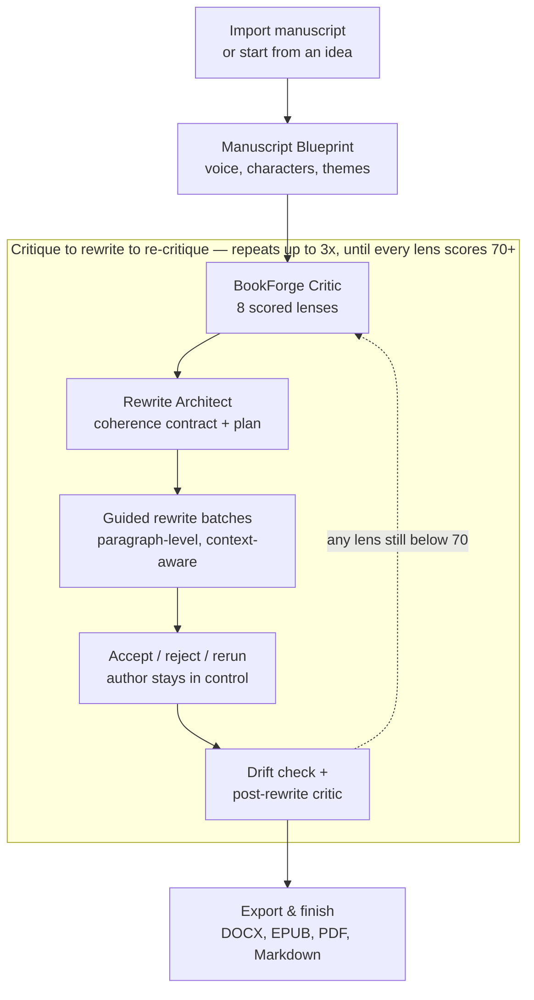
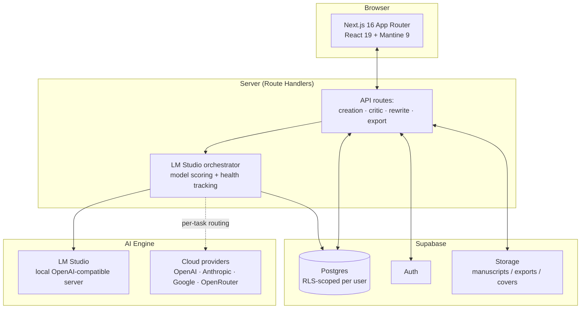
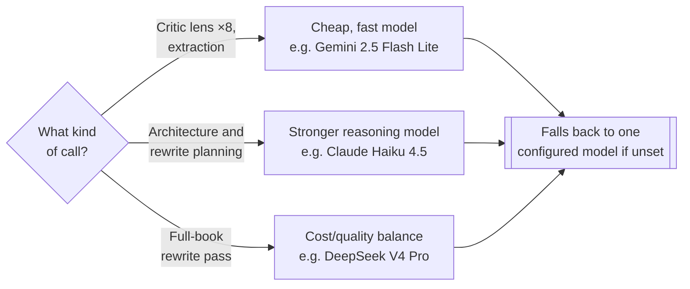

<div align="center">


# BookForge AI

**A local-first revision studio for authors who want an editor, not an autocomplete.**

[](LICENSE)
[](CHANGELOG.md)
[](https://nextjs.org/)
[](https://supabase.com/)
[](https://lmstudio.ai/)
[](https://openrouter.ai/)
[](#language--script-support)

[Quick Start](#quick-start) · [CreativeWriter](#bookforge-creativewriter) · [How-To Guide](docs/HOWTO.md) · [Changelog](CHANGELOG.md) · [Architecture](docs/ARCHITECTURE.md)

</div>

---

## Why this exists

Most "AI writing tools" treat a manuscript as one long string: paste it in, get prose back, hope nothing important got lost in the middle. That works for a tweet. It falls apart for a 300-page book, where a rewritten paragraph in chapter 14 can quietly contradict something established in chapter 2, a character's name can drift, a promise made to the reader in the opening pages can go unpaid by the end.

BookForge starts from a different premise: **a book is a structure, not a blob of text.** Projects contain books. Books contain chapters, scenes, and paragraphs. Every paragraph-level AI rewrite is a versioned, reversible event, never an overwrite: proposed revisions are recorded alongside the original, and accepting or rejecting one never deletes the alternative — nothing ships to the manuscript without a human decision. (Larger structural changes, like regenerating a whole chapter from scratch, are a different, opt-in kind of operation — protected by manual Chapter Snapshots rather than automatic per-paragraph history.) Every AI call carries the *whole-book* context it needs: the Manuscript Blueprint (a generated book bible of characters, themes, voice, and rules), nearby chapter summaries, continuity ledgers, locked passages, and the author's own boundaries.

And it runs on your own machine if you want it to. BookForge talks to [LM Studio](https://lmstudio.ai/) over a local OpenAI-compatible endpoint by default — your manuscript never has to leave your laptop — with the option to route specific tasks to a cloud provider (OpenAI, Anthropic, Google) when you want more horsepower for planning or critique.

---

## What it actually does



Every arrow above can be driven by hand, one step at a time — or handed to the **Auto-Review Wizard**, which runs the entire loop autonomously (summarize → blueprint → critique → rewrite → drift-check → re-critique → export), resuming cleanly from the last completed stage if it's interrupted by sleep, a network drop, or a closed laptop lid.

---

## Feature tour

**Two ways in:**
- **Import an existing manuscript** — TXT, Markdown, DOCX, EPUB, and best-effort Kindle KPF/KCB extraction
- **Create a book from an idea** — a guided wizard turns a working title, genre, tone, and premise into a concept pass, a chapter architecture, and drafted chapters, one AI stage at a time with author approval between each

**Structure & continuity**
- Chapter/scene/paragraph parsing with structure repair, split/merge, and chapter delete
- **Manuscript Blueprint** — an AI-generated book bible: characters, themes, recurring motifs, voice notes, and continuity rules that every later prompt reads from
- **Metadata timeline** — branchable, versioned snapshots of a book's plan and decisions, so "what were we planning at revision 3" is an actual queryable answer, not a guess
- **Dialogue density control** — pick Low / Normal / Above Normal / High at creation time; every generation and rewrite prompt honors it, and a dedicated critic lens checks the finished prose against both the target *and* the book's own chapter-to-chapter consistency

**BookForge Critic** — eight scored evaluation lenses, run individually or all at once: Story Structure, Prose Quality, Continuity, Character Depth, Market Fit, Contemporary View, Revision Priorities, and Dialogue Density. Baseline and post-rewrite reports are saved and compared side by side.

**Rewrite Architect** — scores which of your locally loaded models actually fits a rewrite task, builds a coherence contract (voice rules, character permanence, timeline rules, drift-prevention rules), and executes the rewrite in small, context-loaded units rather than one giant unreliable pass.

**Revision Review** — every rewritten paragraph is a proposal, not a fact. Accept, reject, rerun, or batch-decide; original text is never overwritten; a full rewrite reset is always available.

**Export** — Final Manuscript Builder produces Markdown, DOCX, EPUB, and PDF with an assembly-source preview before you commit to a version; mark one export as **finished** for one-click download from the dashboard. An **Abridged Edition Builder** can produce a shorter version from approved compression suggestions.

**Runs where you tell it to** — LM Studio locally by default, or route specific tasks (critique, planning, rewriting, extraction) to OpenAI, Anthropic, or Google, per task, via an Auto / Local / Cloud execution mode. If a call fails on the configured cloud model, it retries once on a different model before giving up.

**Learns from what actually happens on your machine** — every local model call is recorded (success, empty output, too-short output, context-related crashes). BookForge uses that history to avoid repeating a model+task combination that's already failed, and to request a safer context size the next time — because no two locally loaded models behave the same way, and static name-matching heuristics alone can't tell you that.

### Language & script support

A book's language is a free-text field, not a fixed dropdown — write in anything. The parts of the pipeline that used to quietly assume English (or English + Spanish) now cover a much wider range:

- **Chapter-heading detection** recognizes chapter/prologue/epilogue keywords in English, Spanish, French, Italian, Dutch, Polish, Romanian, and Tagalog, plus CJK counter-word headings (`第3章`, `제1장`).
- **Dialogue-density scoring** counts straight/curly quotes *and* guillemets (`« »`) and em-dash-led dialogue lines — the conventions literary Spanish, French, and Italian actually use.
- **Export** (PDF/EPUB) picks the right embedded font automatically per manuscript: Latin Extended, Cyrillic, Greek, Vietnamese, and Hebrew by default, switching to a dedicated Arabic or CJK font the moment it detects that script in the text — so accented and non-Latin text never renders as missing-glyph boxes. EPUB output also sets the correct `lang` attribute on every chapter, not just the package metadata.
- Known open item: right-to-left *reading order* (Arabic/Hebrew) and CJK-aware word counting aren't solved yet — glyphs render correctly, but full bidi layout is still ahead.

### Platform administration

A **Steward** role (Settings → account, not a generic admin flag) gives trusted staff exactly what's needed to run support without an "admin god-mode" account:

- **Account deletion is a 30-day ban, not a hard delete** — the account is locked out immediately, but nothing is destroyed until a Steward explicitly confirms the purge after the window closes. Nothing is ever auto-purged on a schedule.
- Restore, extend the retention window, or archive/fork any account from one console.
- Cross-book visibility and full management for support — book counts per account, an owner-filtered book list, and one-click **ownership transfer**.
- Every destructive action goes through a real confirmation modal (type-to-confirm for deletes), never a native browser dialog.

## BookForge CreativeWriter

**CreativeWriter 0.1.0** is the first internal prototype of the BookForge-aware writing desk. It is not a standalone desktop executable yet; it is an authenticated BookForge route that proves the product contract before offline packaging work begins.

What is in 0.1.0:

- Linked manuscript workspace with book selection, chapter navigation, paragraph editing, word counts, and dirty-draft protection
- Authenticated sync APIs for link, pull, push, and conflict resolution
- Durable sync ledger migration with applied/rejected/conflict event recording and idempotency checks
- `.bookforge` package import/export helpers and authenticated package transfer routes
- Expanded import intake for common manuscript files and best-effort writing-app exports
- Conflict review with local/cloud comparison, manual merge text, and explicit resolution actions
- Read-only Notes, Research, and Bible panels using existing BookForge metadata
- Support-context search and per-book pinned context cards
- Structural create/delete/reorder guardrails: those operations are rejected until structure versioning, tombstones, and order-conflict review are implemented

The factory plan is documented in [docs/creativewriter-implementation-plan.md](docs/creativewriter-implementation-plan.md), with release readiness tracked in [docs/creativewriter-release-readiness-checklist.md](docs/creativewriter-release-readiness-checklist.md).

---

## Architecture



Nothing about the AI layer is hardcoded to one provider. `selectAndPrepareActiveModel` decides — per call — whether a task goes to a locally loaded LM Studio model or a configured cloud provider, scores every candidate model by name/size/quantization heuristics *and* by this project's own recorded history for that exact model on that exact task, and hands back a prepared client plus the safe context/token budget to use.

### Per-task model routing

With a cloud provider configured, every AI call still gets routed by *task*, not just by provider — a high-volume, latency-sensitive call (critic lenses, extraction) doesn't need the same model as a low-volume call that benefits from stronger reasoning (planning), and the actual cost driver (full-manuscript rewrite passes) is worth tuning independently of both:



This is opt-in per user (**Settings → AI Settings → Optimize per feature**) — leave it off and one model handles everything, same as before.

## Tech stack

| Layer | Choice |
|---|---|
| Framework | Next.js 16 (App Router), React 19, TypeScript |
| UI | Mantine 9, Tailwind CSS 4 — one consistent design system (Inter, brand purple, icon-labeled nav) across every workflow |
| Data | Supabase — Postgres, Auth, Storage, Row-Level Security |
| AI engine | LM Studio (local, OpenAI-compatible) or OpenAI / Anthropic / Google |
| Document handling | DOCX, EPUB, PDF, Markdown, and archive parsing/export |
| Testing | Vitest |
| Current release | BookForge AI 2.0.0, CreativeWriter 0.1.0 |

---

## Quick start

```bash
npm install
supabase start
supabase migration up
cp .env.example .env.local   # fill values from `supabase status`
npm run dev
```

Open `http://localhost:4747`. Start LM Studio, enable its local server, and load at least one instruction-tuned model — then head to **Settings** to point BookForge at it.

New to the app? **[docs/HOWTO.md](docs/HOWTO.md)** walks through real scenarios end to end: revising an existing manuscript, creating a book from an idea, tuning dialogue density, running Auto-Review, and reading the Model Status panel when something misbehaves.

### Environment

```bash
NEXT_PUBLIC_SUPABASE_URL=
NEXT_PUBLIC_SUPABASE_ANON_KEY=
# Optional — defaults shown
LMSTUDIO_BASE_URL=http://localhost:1234/v1
LMSTUDIO_API_KEY=lm-studio
```

Never commit `.env.local`.

---

## Guardrails

BookForge is opinionated about author control:

- Original manuscript text is **never** overwritten — every change is a proposed revision version
- Revision history is append-only (`revision_jobs`, `revision_versions`)
- Locked passages are always respected, in every rewrite unit
- Long-running work uses preflight checks, model-fit scoring, batch sizing, and resumable progress tracking
- Every rewrite/critic prompt carries whole-book context: the Manuscript Blueprint, nearby chapter summaries, character permanence rules, timeline state, recurring motifs, author instructions, and drift-prevention rules — not just the paragraph being touched

## Project structure

```text
src/app/          Next.js routes and API route handlers
src/components/   Mantine UI components and workflow panels
src/lib/          Supabase, LM Studio orchestration, prompts, parsing, revision, export logic
supabase/         Database migrations
docs/             Architecture notes, how-to guide, and planning history
```

## Scripts

```bash
npm run dev      # start the dev server (port 4747)
npm run lint     # eslint
npm run test     # vitest
npm run build    # production build
npm run start    # run a production build
```

## Contributing

Issues and pull requests are welcome. This is a young, fast-moving project — if you're planning something substantial, open an issue first so we can talk through the approach before you invest the time.

## License

BookForge AI is licensed under the **GNU Affero General Public License v3.0** (AGPL-3.0) — see [LICENSE](LICENSE).

In short: you're free to use, modify, and self-host BookForge, including commercially. If you modify it and let others interact with your modified version over a network (including as a hosted service), you must make your modified source available to those users under the same license. This keeps improvements to BookForge — and to any hosted fork of it — in the open.
