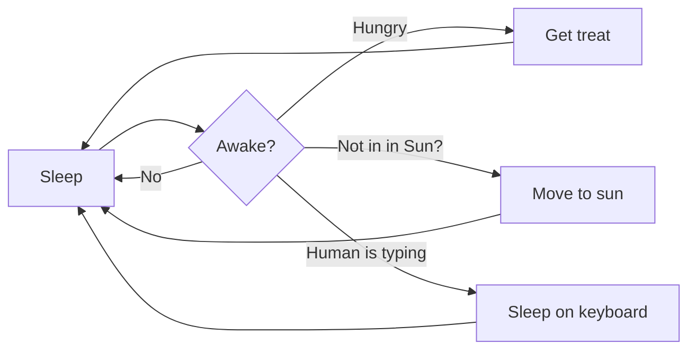
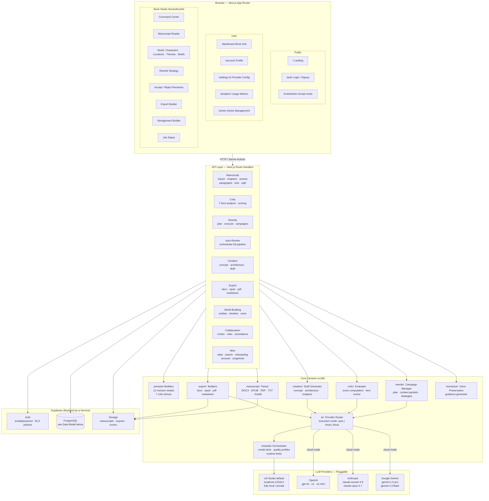
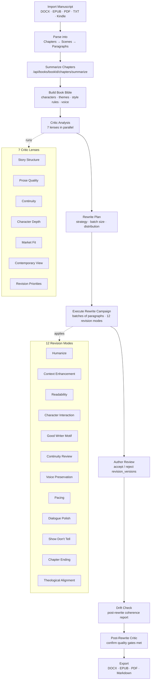
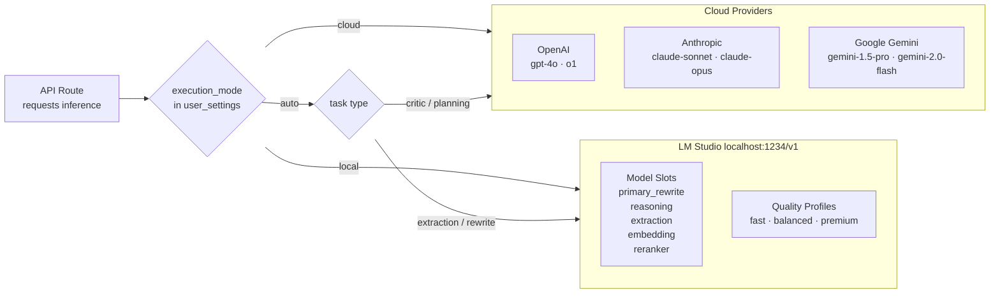

# BookForge — Architecture

> Render this file in VS Code's Markdown preview (⇧⌘V) to see all diagrams interactive.  
> Requires VS Code 1.121+ with the built-in **Mermaid Markdown Features** extension.

---

## Overview

BookForge is a **local-first AI manuscript editor** built on Next.js 15 (App Router), Supabase, and a pluggable LLM backend. Authors import or create manuscripts, run AI-assisted analysis and revision workflows, and export polished drafts — all while keeping the original text immutable and revision history append-only.

**Core design principles:**

- **Privacy by default** — LM Studio runs entirely on `localhost`; no manuscript text leaves the machine unless the author switches to a cloud provider.
- **Author control** — original text is never overwritten; every AI Visual Studio Code 1.121

Show release notes after an update

Follow us on LinkedIn, X, Bluesky | View online

Release date: May 20, 2026

Welcome to the 1.121 release of Visual Studio Code. This release adds built-in Mermaid and HTML previews, streamlines terminal tool behavior for agents, and lets you run agent sessions on remote machines.

Remote agents: Monitor and control agent sessions on a remote machine from the Agents window.

Model configurability: Configure which models handle lightweight tasks like generating commit messages, titles, and more.

Mermaid diagram preview: Render Mermaid diagrams directly in the Markdown preview and notebooks.

HTML file preview: Preview local HTML files in the Integrated Browser without installing an extension.

Terminal tool optimizations: Consume less resources and tokens with more output compression and background terminal cleanup.

Happy Coding!

VS Code is rolling out gradually to all users. Use Check for Updates in VS Code to get the latest version immediately.

To try new features as soon as possible, download the nightly Insiders build, which includes the latest updates as soon as they are available.

In this update
Agents
Language Models
Integrated Browser
Terminal
Languages
Deprecated features and settings
Thank you
Agents
Agents Window (Preview)
We continue improvement to the Agents window, which is the agent-driven companion window brought as a preview to VS Code Stable in our last release.

You can open the Agents window in several ways, including the Open in Agents button in the VS Code title bar. To learn more about how it works and what you can do with it, visit the Agents window documentation.

Your feedback continues to be a great help in shaping Agents. If you've already been using it and providing feedback, thank you! Please continue to file issues on GitHub or browse existing issues.

We're also continuing to work on the broader extension story in the Agents window, including what extension enablement unlocks and how various extensions should behave in this environment. Whether you'd like to ideate on new scenarios that take advantage of running agents across projects, or share feedback on how your existing extension behaves in the Agents window, we'd love to collaborate with you through GitHub issues.

Remote agents (Preview)
The Agents window has experimental support for running agent sessions on a remote machine that you own and can connect to via SSH or dev tunnels. Learn more about remote agent sessions in our documentation.

Screenshot showing the Agents window remote tab for connecting to a remote machine.

Connecting to a remote
You can connect the Agents window to a remote machine in two ways:

SSH: pick from your existing ~/.ssh/config entries, or type a user@host.
Dev Tunnels: pick from tunnels you've already created by running code tunnel on the target machine.
How it works
This feature is similar to, but not the same as, VS Code's remote development extensions. The Agents window connects to the remote, and either downloads and installs the VS Code CLI (SSH) or connects to the running CLI server via a dev tunnel that you started. It starts a lightweight process called the "agent host", which hosts a new agent loop built on the Copilot SDK.

An important point to note is that the remote agent host is a long-lived process. Running sessions continue to run on the remote even if your client disconnects, so you can close your laptop while the remote agent continues working.

Agent Host Protocol
The connection between the Agents window and the agent host is a new open protocol called the Agent Host Protocol (AHP). We're developing it in the open as a standalone spec.

The key design principle of AHP is that it enables coordination of agent sessions across multiple clients simultaneously. This is how it differs from other protocols like ACP. An agent host manages authoritative state, synchronizes it to every connected client, and sequences all mutations through pure reducers.

Because AHP is an open protocol, anyone can build a client that connects to the VS Code CLI's agent host, or build an AHP agent host that VS Code can connect to.

Agents observability with OpenTelemetry and Grafana
In collaboration with the Azure Managed Grafana team, there is now a prebuilt Azure Managed Grafana dashboard for the OpenTelemetry signals that agents in VS Code emit. Point VS Code at an OTel Collector that forwards to Azure Application Insights, then import the Azure Managed Grafana dashboard to visualize agent operations, token usage, chat sessions, tool calls, and per-model response time and time to first token (TTFT).

See Monitor AI coding agents with Grafana for the end-to-end setup, and Monitor agent usage with OpenTelemetry for enabling export from VS Code.

Screenshot showing the GitHub Copilot Grafana dashboard with panels for operations, tokens, chat sessions, tool calls, and per-model latency.

Claude agent Auto permission mode (Preview)
Setting:   github.copilot.chat.claudeAgent.allowAutoPermVisual Studio Code 1.121

Show release notes after an update

Follow us on LinkedIn, X, Bluesky | View online

Release date: May 20, 2026

Welcome to the 1.121 release of Visual Studio Code. This release adds built-in Mermaid and HTML previews, streamlines terminal tool behavior for agents, and lets you run agent sessions on remote machines.

Remote agents: Monitor and control agent sessions on a remote machine from the Agents window.

Model configurability: Configure which models handle lightweight tasks like generating commit messages, titles, and more.

Mermaid diagram preview: Render Mermaid diagrams directly in the Markdown preview and notebooks.

HTML file preview: Preview local HTML files in the Integrated Browser without installing an extension.

Terminal tool optimizations: Consume less resources and tokens with more output compression and background terminal cleanup.

Happy Coding!

VS Code is rolling out gradually to all users. Use Check for Updates in VS Code to get the latest version immediately.

To try new features as soon as possible, download the nightly Insiders build, which includes the latest updates as soon as they are available.

In this update
Agents
Language Models
Integrated Browser
Terminal
Languages
Deprecated features and settings
Thank you
Agents
Agents Window (Preview)
We continue improvement to the Agents window, which is the agent-driven companion window brought as a preview to VS Code Stable in our last release.

You can open the Agents window in several ways, including the Open in Agents button in the VS Code title bar. To learn more about how it works and what you can do with it, visit the Agents window documentation.

Your feedback continues to be a great help in shaping Agents. If you've already been using it and providing feedback, thank you! Please continue to file issues on GitHub or browse existing issues.

We're also continuing to work on the broader extension story in the Agents window, including what extension enablement unlocks and how various extensions should behave in this environment. Whether you'd like to ideate on new scenarios that take advantage of running agents across projects, or share feedback on how your existing extension behaves in the Agents window, we'd love to collaborate with you through GitHub issues.

Remote agents (Preview)
The Agents window has experimental support for running agent sessions on a remote machine that you own and can connect to via SSH or dev tunnels. Learn more about remote agent sessions in our documentation.

Screenshot showing the Agents window remote tab for connecting to a remote machine.

Connecting to a remote
You can connect the Agents window to a remote machine in two ways:

SSH: pick from your existing ~/.ssh/config entries, or type a user@host.
Dev Tunnels: pick from tunnels you've already created by running code tunnel on the target machine.
How it works
This feature is similar to, but not the same as, VS Code's remote development extensions. The Agents window connects to the remote, and either downloads and installs the VS Code CLI (SSH) or connects to the running CLI server via a dev tunnel that you started. It starts a lightweight process called the "agent host", which hosts a new agent loop built on the Copilot SDK.

An important point to note is that the remote agent host is a long-lived process. Running sessions continue to run on the remote even if your client disconnects, so you can close your laptop while the remote agent continues working.

Agent Host Protocol
The connection between the Agents window and the agent host is a new open protocol called the Agent Host Protocol (AHP). We're developing it in the open as a standalone spec.

The key design principle of AHP is that it enables coordination of agent sessions across multiple clients simultaneously. This is how it differs from other protocols like ACP. An agent host manages authoritative state, synchronizes it to every connected client, and sequences all mutations through pure reducers.

Because AHP is an open protocol, anyone can build a client that connects to the VS Code CLI's agent host, or build an AHP agent host that VS Code can connect to.

Agents observability with OpenTelemetry and Grafana
In collaboration with the Azure Managed Grafana team, there is now a prebuilt Azure Managed Grafana dashboard for the OpenTelemetry signals that agents in VS Code emit. Point VS Code at an OTel Collector that forwards to Azure Application Insights, then import the Azure Managed Grafana dashboard to visualize agent operations, token usage, chat sessions, tool calls, and per-model response time and time to first token (TTFT).

See Monitor AI coding agents with Grafana for the end-to-end setup, and Monitor agent usage with OpenTelemetry for enabling export from VS Code.

Screenshot showing the GitHub Copilot Grafana dashboard with panels for operations, tokens, chat sessions, tool calls, and per-model latency.

Claude agent Auto permission mode (Preview)
Setting:   github.copilot.chat.claudeAgent.allowAutoPermissions

The Claude Agent now supports Auto mode, which lets Claude execute without permission prompts. A separate classifier request reviews actions before they run, blocking anything that escalates beyond your request, targets unrecognized infrastructure, or appears driven by hostile content Claude read. This is useful for long-running tasks where you want to reduce prompt fatigue while still keeping background safety checks in place.

Claude agent auto mode

To see the Auto option in the permission mode picker, enable   github.copilot.chat.claudeAgent.allowAutoPermissions .

Note: If you want fully unattended execution with no safety checks ("YOLO mode"), enable   github.copilot.chat.claudeAgent.allowDangerouslySkipPermissions to allow "Bypass all permissions" to show up.

Language Models
This release includes several improvements to how you configure and manage language models in VS Code, giving you more control over which models you use for different tasks within VS Code. Learn more about language models in our documentation.

Configure utility models
Settings:   chat.utilityModel ,   chat.utilitySmallModel

VS Code uses utility models in the background for chat-related tasks such as generating titles, summaries, commit messages, rename suggestions, prompt categorization, and intent detection. By default, these tasks use utility models provided by GitHub Copilot.

You can use your own available models, including Bring Your Own Key (BYOK) models, for these flows:

  chat.utilityModel : Override the model used for general utility flows.
  chat.utilitySmallModel : Override the model used for fast, lightweight utility flows. A fast and inexpensive model is recommended for this setting.
Both settings use Default unless configured, which keeps the GitHub Copilot-provided utility models..

Custom Endpoint provider for BYOK (Insiders)
We now ship a new BYOK provider, the Custom Endpoint provider, that lets you plug any Chat Completions, Responses, or Messages-compatible endpoint into Copilot Chat from a single configuration. It replaces the legacy OpenAI Compatible (customoai) provider, which only supported Chat Completions and is now marked for deprecation.

Screenshot showing the dropdown options for adding a new model in the Language Models editor, with the new Custom Endpoint option.

When you add a model from this provider, you can pick which API family it belongs to (chat-completions, responses, or messages).

Screenshot showing the Custom Endpoint model configuration form with an API type dropdown.

Note: The Custom Endpoint provider is currently in preview and only available in VS Code Insiders.

Integrated Browser
Quickly open HTML files in the Integrated Browser
Previously, previewing an HTML file required installing an extension, which is unnecessary friction for something so common. You can now easily open local HTML files via the Open in Integrated Browser option by right-clicking the file in the File Explorer, or right-clicking the editor tab when the file is already open. You can also select the Preview icon in the editor title bar when an HTML file is active.

Screenshot showing the editor title bar with an HTML file open and an Open in Integrated Browser icon.

Improved experience for adding elements to chat
We have reworked the element selection UI to enable richer functionality and theming support.

Select a range of elements
You can now click and drag to select a range of elements, making it easier to target shared container elements.


Attach elements from context menus
You can now right-click anywhere in a page to quickly attach elements to the chat.

Screenshot showing a context menu opened on an element with an Add Element to Chat item.

Terminal
Agent-aware terminal commands
Command-line tools had no way to tell whether a terminal command was launched by a human or by VS Code's agent flow, which meant progress animations, interactive prompts, and verbose formatting could block or confuse agent sessions.

VS Code now sets a VSCODE_AGENT environment variable for agent-initiated terminal commands. CLIs can check this variable to switch to machine-readable output, suppress progress animations, or skip prompts that would otherwise block the session.

If you maintain scripts or CLIs that already adjust behavior for CI or other agents, you can use the same pattern for commands launched from Copilot Chat.

Running in background indicator for terminal tools
Previously, when a chat terminal command kept running after the tool call returned, the chat UI looked like the command had already finished, making it hard to tell that work was still in progress.

Tool invocations now show Running <command> in background - Show while the terminal is still active. The Show action lets you reveal and focus the underlying terminal. Once the command finishes, the header returns to the normal completed state.

This makes it clearer when a command is still running in the background, especially for async runs or commands that were promoted to background execution after a timeout.

Cleanup of background agent terminals
Previously, when you had a long-running chat session that involved multiple terminal commands, you could accumulate background terminals after each command finished, filling up the terminal list with stale entries and consuming resources.

VS Code now automatically disposes background terminals created by the chat agent when their command completes, while still preserving the command output in the chat UI. If you reveal a background terminal with Show, it stays open so you can continue inspecting or interacting with it.

This keeps terminal lists clean and reduces resource usage over multi-turn sessions.

Broader compression for terminal tool output
Setting:   chat.tools.compressOutput.enabled

Commands like pytest, jest, cargo test, tsc, and package installation workflows often produce large volumes of progress output before surfacing the important result, wasting tokens and making it harder for the model to find the relevant information.

Chat terminal tools now compress more kinds of verbose command output before sending it back to the model. The expanded coverage includes common test runners, build tools, linters, Docker commands, and package managers, so repetitive progress information and other low-value output are trimmed more often.

Long terminal runs are now easier for the model to interpret and less likely to spend tokens on boilerplate output.

Sensitive terminal prompts stay in the terminal
Password, passphrase, PIN, or verification-code prompts in terminal commands can pose a risk: the agent could accidentally capture or replay secrets if it tried to handle these prompts itself.

When a chat terminal command reaches a sensitive prompt, VS Code now intercepts it. In default permissions mode, chat shows a confirmation dialog that lets you focus the terminal to enter the secret directly there. In auto-approve flows, VS Code cancels the command and tells the model not to retry or request the secret.

This keeps credentials out of the chat context and prevents the agent from accidentally exposing or replaying sensitive input.

Editor
Quick suggestions default setting change
Copilot's inline suggestions always align with the selection of the suggest control. This is very useful, as you can quickly press Tab twice to accept both the suggestion and the ghost text from Copilot.

However, we've found that as you start to type, in many cases the suggest control pops up and selects the very first (alphabetical) available global symbol that starts with the typed character. This is rarely the text you'd actually type and it also results in Copilot giving you suggestions with that, incorrect, prefix, thus making the experience more noisy.

We've decided to change the default setting for quick suggestions (  editor.quickSuggestions ). If an inline completion provider is available (such as Copilot), then typing letters in the editor no longer automatically triggers the suggest control. In all other cases, the suggest control pops up as before. You can revert to the old behavior by configuring:

"editor.quickSuggestions": {
  "other": "on",
  "comments": "off",
  "strings": "off"
}

Languages
Mermaid diagrams in Markdown preview and Notebooks
We've merged Matt Bierner's Markdown Preview Mermaid Support extension into VS Code as a new built-in extension called Mermaid Markdown Features. This extension adds Mermaid diagram rendering to VS Code's built-in Markdown preview, to Markdown cells in notebooks, and to chats.

Mermaid diagrams can be created using a mermaid fenced code block in your Markdown:



Here's what the diagram looks like in the Markdown preview:

Screenshot showing a rendered Mermaid diagram in the Markdown preview.

Rendered Mermaid diagrams also support panning and zooming, which makes larger diagrams easier to inspect without leaving the preview. You can also right-click a diagram to copy its Mermaid source.

YAML frontmatter in Markdown preview
Setting:   markdown.preview.frontMatter

We've added options that control how YAML front matter is rendered in the Markdown preview. By default, instead of hiding the preamble, VS Code displays front matter as a table at the top of the preview.

Screenshot showing Markdown frontmatter rendered as a table in the preview.

You can use the   markdown.preview.frontMatter setting to choose how front matter appears:

table (default): Render front matter as a table.
codeBlock: Render front matter as a YAML code block.
hide: Hide front matter from the preview.
The rendered frontmatter also has a context menu entry for quickly opening this setting from the preview.

Deprecated features and settings
New deprecations in this release
Upcoming deprecations
Thank you
Contributions to our issue tracking:

@gjsjohnmurray (John Murray)
@RedCMD (RedCMD)
@IllusionMH (Andrii Dieiev)
@albertosantini (Alberto Santini)
Contributions to vscode:

@ba-work (Brock Alberry): outputMonitor: fix two false-positive families pausing the agent loop PR #315485
@guomaggie: Return final answer text when snippet hydration errors PR #316094
@kevin-m-kent: Experiment with terminal output deltas for repeated polls PR #315543
@NikolaRHristov (Nikola Hristov): fix: restore protected modifier on relayCreationTimeoutMs in test helper PR #316049
@SebTardif (Sebastien Tardif): Fix listener leak: move onDidChangeConfiguration out of onDidProgressStep callback PR #314636
@SimonSiefke (Simon Siefke): fix: memory leak in lifeCycleMainService PR #315891
@thernstig (Tobias Hernstig): fix: replace typescript.tsdk.desc with new js/ts.tsdk.path PR #315268
@thirteenflt (yutingsun): change vsc promptD PR #316733
@yavanosta (Dmitry Guketlev): Make appearedInsideViewport in InlineCompletionsModel reactive (#289944) PR #289946
We really appreciate people trying our new features as soon as they are ready, so check back here often and learn what's new.

If you'd like to read release notes for previous VS Code versions, go to Updates on code.visualstudio.com.

issions

The Claude Agent now supports Auto mode, which lets Claude execute without permission prompts. A separate classifier request reviews actions before they run, blocking anything that escalates beyond your request, targets unrecognized infrastructure, or appears driven by hostile content Claude read. This is useful for long-running tasks where you want to reduce prompt fatigue while still keeping background safety checks in place.

Claude agent auto mode

To see the Auto option in the permission mode picker, enable   github.copilot.chat.claudeAgent.allowAutoPermissions .

Note: If you want fully unattended execution with no safety checks ("YOLO mode"), enable   github.copilot.chat.claudeAgent.allowDangerouslySkipPermissions to allow "Bypass all permissions" to show up.

Language Models
This release includes several improvements to how you configure and manage language models in VS Code, giving you more control over which models you use for different tasks within VS Code. Learn more about language models in our documentation.

Configure utility models
Settings:   chat.utilityModel ,   chat.utilitySmallModel

VS Code uses utility models in the background for chat-related tasks such as generating titles, summaries, commit messages, rename suggestions, prompt categorization, and intent detection. By default, these tasks use utility models provided by GitHub Copilot.

You can use your own available models, including Bring Your Own Key (BYOK) models, for these flows:

  chat.utilityModel : Override the model used for general utility flows.
  chat.utilitySmallModel : Override the model used for fast, lightweight utility flows. A fast and inexpensive model is recommended for this setting.
Both settings use Default unless configured, which keeps the GitHub Copilot-provided utility models..

Custom Endpoint provider for BYOK (Insiders)
We now ship a new BYOK provider, the Custom Endpoint provider, that lets you plug any Chat Completions, Responses, or Messages-compatible endpoint into Copilot Chat from a single configuration. It replaces the legacy OpenAI Compatible (customoai) provider, which only supported Chat Completions and is now marked for deprecation.

Screenshot showing the dropdown options for adding a new model in the Language Models editor, with the new Custom Endpoint option.

When you add a model from this provider, you can pick which API family it belongs to (chat-completions, responses, or messages).

Screenshot showing the Custom Endpoint model configuration form with an API type dropdown.

Note: The Custom Endpoint provider is currently in preview and only available in VS Code Insiders.

Integrated Browser
Quickly open HTML files in the Integrated Browser
Previously, previewing an HTML file required installing an extension, which is unnecessary friction for something so common. You can now easily open local HTML files via the Open in Integrated Browser option by right-clicking the file in the File Explorer, or right-clicking the editor tab when the file is already open. You can also select the Preview icon in the editor title bar when an HTML file is active.

Screenshot showing the editor title bar with an HTML file open and an Open in Integrated Browser icon.

Improved experience for adding elements to chat
We have reworked the element selection UI to enable richer functionality and theming support.

Select a range of elements
You can now click and drag to select a range of elements, making it easier to target shared container elements.


Attach elements from context menus
You can now right-click anywhere in a page to quickly attach elements to the chat.

Screenshot showing a context menu opened on an element with an Add Element to Chat item.

Terminal
Agent-aware terminal commands
Command-line tools had no way to tell whether a terminal command was launched by a human or by VS Code's agent flow, which meant progress animations, interactive prompts, and verbose formatting could block or confuse agent sessions.

VS Code now sets a VSCODE_AGENT environment variable for agent-initiated terminal commands. CLIs can check this variable to switch to machine-readable output, suppress progress animations, or skip prompts that would otherwise block the session.

If you maintain scripts or CLIs that already adjust behavior for CI or other agents, you can use the same pattern for commands launched from Copilot Chat.

Running in background indicator for terminal tools
Previously, when a chat terminal command kept running after the tool call returned, the chat UI looked like the command had already finished, making it hard to tell that work was still in progress.

Tool invocations now show Running <command> in background - Show while the terminal is still active. The Show action lets you reveal and focus the underlying terminal. Once the command finishes, the header returns to the normal completed state.

This makes it clearer when a command is still running in the background, especially for async runs or commands that were promoted to background execution after a timeout.

Cleanup of background agent terminals
Previously, when you had a long-running chat session that involved multiple terminal commands, you could accumulate background terminals after each command finished, filling up the terminal list with stale entries and consuming resources.

VS Code now automatically disposes background terminals created by the chat agent when their command completes, while still preserving the command output in the chat UI. If you reveal a background terminal with Show, it stays open so you can continue inspecting or interacting with it.

This keeps terminal lists clean and reduces resource usage over multi-turn sessions.

Broader compression for terminal tool output
Setting:   chat.tools.compressOutput.enabled

Commands like pytest, jest, cargo test, tsc, and package installation workflows often produce large volumes of progress output before surfacing the important result, wasting tokens and making it harder for the model to find the relevant information.

Chat terminal tools now compress more kinds of verbose command output before sending it back to the model. The expanded coverage includes common test runners, build tools, linters, Docker commands, and package managers, so repetitive progress information and other low-value output are trimmed more often.

Long terminal runs are now easier for the model to interpret and less likely to spend tokens on boilerplate output.

Sensitive terminal prompts stay in the terminal
Password, passphrase, PIN, or verification-code prompts in terminal commands can pose a risk: the agent could accidentally capture or replay secrets if it tried to handle these prompts itself.

When a chat terminal command reaches a sensitive prompt, VS Code now intercepts it. In default permissions mode, chat shows a confirmation dialog that lets you focus the terminal to enter the secret directly there. In auto-approve flows, VS Code cancels the command and tells the model not to retry or request the secret.

This keeps credentials out of the chat context and prevents the agent from accidentally exposing or replaying sensitive input.

Editor
Quick suggestions default setting change
Copilot's inline suggestions always align with the selection of the suggest control. This is very useful, as you can quickly press Tab twice to accept both the suggestion and the ghost text from Copilot.

However, we've found that as you start to type, in many cases the suggest control pops up and selects the very first (alphabetical) available global symbol that starts with the typed character. This is rarely the text you'd actually type and it also results in Copilot giving you suggestions with that, incorrect, prefix, thus making the experience more noisy.

We've decided to change the default setting for quick suggestions (  editor.quickSuggestions ). If an inline completion provider is available (such as Copilot), then typing letters in the editor no longer automatically triggers the suggest control. In all other cases, the suggest control pops up as before. You can revert to the old behavior by configuring:

"editor.quickSuggestions": {
  "other": "on",
  "comments": "off",
  "strings": "off"
}

Languages
Mermaid diagrams in Markdown preview and Notebooks
We've merged Matt Bierner's Markdown Preview Mermaid Support extension into VS Code as a new built-in extension called Mermaid Markdown Features. This extension adds Mermaid diagram rendering to VS Code's built-in Markdown preview, to Markdown cells in notebooks, and to chats.

Mermaid diagrams can be created using a mermaid fenced code block in your Markdown:


Here's what the diagram looks like in the Markdown preview:

Screenshot showing a rendered Mermaid diagram in the Markdown preview.

Rendered Mermaid diagrams also support panning and zooming, which makes larger diagrams easier to inspect without leaving the preview. You can also right-click a diagram to copy its Mermaid source.

YAML frontmatter in Markdown preview
Setting:   markdown.preview.frontMatter

We've added options that control how YAML front matter is rendered in the Markdown preview. By default, instead of hiding the preamble, VS Code displays front matter as a table at the top of the preview.

Screenshot showing Markdown frontmatter rendered as a table in the preview.

You can use the   markdown.preview.frontMatter setting to choose how front matter appears:

table (default): Render front matter as a table.
codeBlock: Render front matter as a YAML code block.
hide: Hide front matter from the preview.
The rendered frontmatter also has a context menu entry for quickly opening this setting from the preview.

Deprecated features and settings
New deprecations in this release
Upcoming deprecations
Thank you
Contributions to our issue tracking:

@gjsjohnmurray (John Murray)
@RedCMD (RedCMD)
@IllusionMH (Andrii Dieiev)
@albertosantini (Alberto Santini)
Contributions to vscode:

@ba-work (Brock Alberry): outputMonitor: fix two false-positive families pausing the agent loop PR #315485
@guomaggie: Return final answer text when snippet hydration errors PR #316094
@kevin-m-kent: Experiment with terminal output deltas for repeated polls PR #315543
@NikolaRHristov (Nikola Hristov): fix: restore protected modifier on relayCreationTimeoutMs in test helper PR #316049
@SebTardif (Sebastien Tardif): Fix listener leak: move onDidChangeConfiguration out of onDidProgressStep callback PR #314636
@SimonSiefke (Simon Siefke): fix: memory leak in lifeCycleMainService PR #315891
@thernstig (Tobias Hernstig): fix: replace typescript.tsdk.desc with new js/ts.tsdk.path PR #315268
@thirteenflt (yutingsun): change vsc promptD PR #316733
@yavanosta (Dmitry Guketlev): Make appearedInsideViewport in InlineCompletionsModel reactive (#289944) PR #289946
We really appreciate people trying our new features as soon as they are ready, so check back here often and learn what's new.

If you'd like to read release notes for previous VS Code versions, go to Updates on code.visualstudio.com.

Visual Studio Code 1.121

Show release notes after an update

Follow us on LinkedIn, X, Bluesky | View online

Release date: May 20, 2026

Welcome to the 1.121 release of Visual Studio Code. This release adds built-in Mermaid and HTML previews, streamlines terminal tool behavior for agents, and lets you run agent sessions on remote machines.

Remote agents: Monitor and control agent sessions on a remote machine from the Agents window.

Model configurability: Configure which models handle lightweight tasks like generating commit messages, titles, and more.

Mermaid diagram preview: Render Mermaid diagrams directly in the Markdown preview and notebooks.

HTML file preview: Preview local HTML files in the Integrated Browser without installing an extension.

Terminal tool optimizations: Consume less resources and tokens with more output compression and background terminal cleanup.

Happy Coding!

VS Code is rolling out gradually to all users. Use Check for Updates in VS Code to get the latest version immediately.

To try new features as soon as possible, download the nightly Insiders build, which includes the latest updates as soon as they are available.

In this update
Agents
Language Models
Integrated Browser
Terminal
Languages
Deprecated features and settings
Thank you
Agents
Agents Window (Preview)
We continue improvement to the Agents window, which is the agent-driven companion window brought as a preview to VS Code Stable in our last release.

You can open the Agents window in several ways, including the Open in Agents button in the VS Code title bar. To learn more about how it works and what you can do with it, visit the Agents window documentation.

Your feedback continues to be a great help in shaping Agents. If you've already been using it and providing feedback, thank you! Please continue to file issues on GitHub or browse existing issues.

We're also continuing to work on the broader extension story in the Agents window, including what extension enablement unlocks and how various extensions should behave in this environment. Whether you'd like to ideate on new scenarios that take advantage of running agents across projects, or share feedback on how your existing extension behaves in the Agents window, we'd love to collaborate with you through GitHub issues.

Remote agents (Preview)
The Agents window has experimental support for running agent sessions on a remote machine that you own and can connect to via SSH or dev tunnels. Learn more about remote agent sessions in our documentation.

Screenshot showing the Agents window remote tab for connecting to a remote machine.

Connecting to a remote
You can connect the Agents window to a remote machine in two ways:

SSH: pick from your existing ~/.ssh/config entries, or type a user@host.
Dev Tunnels: pick from tunnels you've already created by running code tunnel on the target machine.
How it works
This feature is similar to, but not the same as, VS Code's remote development extensions. The Agents window connects to the remote, and either downloads and installs the VS Code CLI (SSH) or connects to the running CLI server via a dev tunnel that you started. It starts a lightweight process called the "agent host", which hosts a new agent loop built on the Copilot SDK.

An important point to note is that the remote agent host is a long-lived process. Running sessions continue to run on the remote even if your client disconnects, so you can close your laptop while the remote agent continues working.

Agent Host Protocol
The connection between the Agents window and the agent host is a new open protocol called the Agent Host Protocol (AHP). We're developing it in the open as a standalone spec.

The key design principle of AHP is that it enables coordination of agent sessions across multiple clients simultaneously. This is how it differs from other protocols like ACP. An agent host manages authoritative state, synchronizes it to every connected client, and sequences all mutations through pure reducers.

Because AHP is an open protocol, anyone can build a client that connects to the VS Code CLI's agent host, or build an AHP agent host that VS Code can connect to.

Agents observability with OpenTelemetry and Grafana
In collaboration with the Azure Managed Grafana team, there is now a prebuilt Azure Managed Grafana dashboard for the OpenTelemetry signals that agents in VS Code emit. Point VS Code at an OTel Collector that forwards to Azure Application Insights, then import the Azure Managed Grafana dashboard to visualize agent operations, token usage, chat sessions, tool calls, and per-model response time and time to first token (TTFT).

See Monitor AI coding agents with Grafana for the end-to-end setup, and Monitor agent usage with OpenTelemetry for enabling export from VS Code.

Screenshot showing the GitHub Copilot Grafana dashboard with panels for operations, tokens, chat sessions, tool calls, and per-model latency.

Claude agent Auto permission mode (Preview)
Setting:   github.copilot.chat.claudeAgent.allowAutoPermissions

The Claude Agent now supports Auto mode, which lets Claude execute without permission prompts. A separate classifier request reviews actions before they run, blocking anything that escalates beyond your request, targets unrecognized infrastructure, or appears driven by hostile content Claude read. This is useful for long-running tasks where you want to reduce prompt fatigue while still keeping background safety checks in place.

Claude agent auto mode

To see the Auto option in the permission mode picker, enable   github.copilot.chat.claudeAgent.allowAutoPermissions .

Note: If you want fully unattended execution with no safety checks ("YOLO mode"), enable   github.copilot.chat.claudeAgent.allowDangerouslySkipPermissions to allow "Bypass all permissions" to show up.

Language Models
This release includes several improvements to how you configure and manage language models in VS Code, giving you more control over which models you use for different tasks within VS Code. Learn more about language models in our documentation.

Configure utility models
Settings:   chat.utilityModel ,   chat.utilitySmallModel

VS Code uses utility models in the background for chat-related tasks such as generating titles, summaries, commit messages, rename suggestions, prompt categorization, and intent detection. By default, these tasks use utility models provided by GitHub Copilot.

You can use your own available models, including Bring Your Own Key (BYOK) models, for these flows:

  chat.utilityModel : Override the model used for general utility flows.
  chat.utilitySmallModel : Override the model used for fast, lightweight utility flows. A fast and inexpensive model is recommended for this setting.
Both settings use Default unless configured, which keeps the GitHub Copilot-provided utility models..

Custom Endpoint provider for BYOK (Insiders)
We now ship a new BYOK provider, the Custom Endpoint provider, that lets you plug any Chat Completions, Responses, or Messages-compatible endpoint into Copilot Chat from a single configuration. It replaces the legacy OpenAI Compatible (customoai) provider, which only supported Chat Completions and is now marked for deprecation.

Screenshot showing the dropdown options for adding a new model in the Language Models editor, with the new Custom Endpoint option.

When you add a model from this provider, you can pick which API family it belongs to (chat-completions, responses, or messages).

Screenshot showing the Custom Endpoint model configuration form with an API type dropdown.

Note: The Custom Endpoint provider is currently in preview and only available in VS Code Insiders.

Integrated Browser
Quickly open HTML files in the Integrated Browser
Previously, previewing an HTML file required installing an extension, which is unnecessary friction for something so common. You can now easily open local HTML files via the Open in Integrated Browser option by right-clicking the file in the File Explorer, or right-clicking the editor tab when the file is already open. You can also select the Preview icon in the editor title bar when an HTML file is active.

Screenshot showing the editor title bar with an HTML file open and an Open in Integrated Browser icon.

Improved experience for adding elements to chat
We have reworked the element selection UI to enable richer functionality and theming support.

Select a range of elements
You can now click and drag to select a range of elements, making it easier to target shared container elements.


Attach elements from context menus
You can now right-click anywhere in a page to quickly attach elements to the chat.

Screenshot showing a context menu opened on an element with an Add Element to Chat item.

Terminal
Agent-aware terminal commands
Command-line tools had no way to tell whether a terminal command was launched by a human or by VS Code's agent flow, which meant progress animations, interactive prompts, and verbose formatting could block or confuse agent sessions.

VS Code now sets a VSCODE_AGENT environment variable for agent-initiated terminal commands. CLIs can check this variable to switch to machine-readable output, suppress progress animations, or skip prompts that would otherwise block the session.

If you maintain scripts or CLIs that already adjust behavior for CI or other agents, you can use the same pattern for commands launched from Copilot Chat.

Running in background indicator for terminal tools
Previously, when a chat terminal command kept running after the tool call returned, the chat UI looked like the command had already finished, making it hard to tell that work was still in progress.

Tool invocations now show Running <command> in background - Show while the terminal is still active. The Show action lets you reveal and focus the underlying terminal. Once the command finishes, the header returns to the normal completed state.

This makes it clearer when a command is still running in the background, especially for async runs or commands that were promoted to background execution after a timeout.

Cleanup of background agent terminals
Previously, when you had a long-running chat session that involved multiple terminal commands, you could accumulate background terminals after each command finished, filling up the terminal list with stale entries and consuming resources.

VS Code now automatically disposes background terminals created by the chat agent when their command completes, while still preserving the command output in the chat UI. If you reveal a background terminal with Show, it stays open so you can continue inspecting or interacting with it.

This keeps terminal lists clean and reduces resource usage over multi-turn sessions.

Broader compression for terminal tool output
Setting:   chat.tools.compressOutput.enabled

Commands like pytest, jest, cargo test, tsc, and package installation workflows often produce large volumes of progress output before surfacing the important result, wasting tokens and making it harder for the model to find the relevant information.

Chat terminal tools now compress more kinds of verbose command output before sending it back to the model. The expanded coverage includes common test runners, build tools, linters, Docker commands, and package managers, so repetitive progress information and other low-value output are trimmed more often.

Long terminal runs are now easier for the model to interpret and less likely to spend tokens on boilerplate output.

Sensitive terminal prompts stay in the terminal
Password, passphrase, PIN, or verification-code prompts in terminal commands can pose a risk: the agent could accidentally capture or replay secrets if it tried to handle these prompts itself.

When a chat terminal command reaches a sensitive prompt, VS Code now intercepts it. In default permissions mode, chat shows a confirmation dialog that lets you focus the terminal to enter the secret directly there. In auto-approve flows, VS Code cancels the command and tells the model not to retry or request the secret.

This keeps credentials out of the chat context and prevents the agent from accidentally exposing or replaying sensitive input.

Editor
Quick suggestions default setting change
Copilot's inline suggestions always align with the selection of the suggest control. This is very useful, as you can quickly press Tab twice to accept both the suggestion and the ghost text from Copilot.

However, we've found that as you start to type, in many cases the suggest control pops up and selects the very first (alphabetical) available global symbol that starts with the typed character. This is rarely the text you'd actually type and it also results in Copilot giving you suggestions with that, incorrect, prefix, thus making the experience more noisy.

We've decided to change the default setting for quick suggestions (  editor.quickSuggestions ). If an inline completion provider is available (such as Copilot), then typing letters in the editor no longer automatically triggers the suggest control. In all other cases, the suggest control pops up as before. You can revert to the old behavior by configuring:

"editor.quickSuggestions": {
  "other": "on",
  "comments": "off",
  "strings": "off"
}

Languages
Mermaid diagrams in Markdown preview and Notebooks
We've merged Matt Bierner's Markdown Preview Mermaid Support extension into VS Code as a new built-in extension called Mermaid Markdown Features. This extension adds Mermaid diagram rendering to VS Code's built-in Markdown preview, to Markdown cells in notebooks, and to chats.

Mermaid diagrams can be created using a mermaid fenced code block in your Markdown:


Here's what the diagram looks like in the Markdown preview:

Screenshot showing a rendered Mermaid diagram in the Markdown preview.

Rendered Mermaid diagrams also support panning and zooming, which makes larger diagrams easier to inspect without leaving the preview. You can also right-click a diagram to copy its Mermaid source.

YAML frontmatter in Markdown preview
Setting:   markdown.preview.frontMatter

We've added options that control how YAML front matter is rendered in the Markdown preview. By default, instead of hiding the preamble, VS Code displays front matter as a table at the top of the preview.

Screenshot showing Markdown frontmatter rendered as a table in the preview.

You can use the   markdown.preview.frontMatter setting to choose how front matter appears:

table (default): Render front matter as a table.
codeBlock: Render front matter as a YAML code block.
hide: Hide front matter from the preview.
The rendered frontmatter also has a context menu entry for quickly opening this setting from the preview.

Deprecated features and settings
New deprecations in this release
Upcoming deprecations
Thank you
Contributions to our issue tracking:

@gjsjohnmurray (John Murray)
@RedCMD (RedCMD)
@IllusionMH (Andrii Dieiev)
@albertosantini (Alberto Santini)
Contributions to vscode:

@ba-work (Brock Alberry): outputMonitor: fix two false-positive families pausing the agent loop PR #315485
@guomaggie: Return final answer text when snippet hydration errors PR #316094
@kevin-m-kent: Experiment with terminal output deltas for repeated polls PR #315543
@NikolaRHristov (Nikola Hristov): fix: restore protected modifier on relayCreationTimeoutMs in test helper PR #316049
@SebTardif (Sebastien Tardif): Fix listener leak: move onDidChangeConfiguration out of onDidProgressStep callback PR #314636
@SimonSiefke (Simon Siefke): fix: memory leak in lifeCycleMainService PR #315891
@thernstig (Tobias Hernstig): fix: replace typescript.tsdk.desc with new js/ts.tsdk.path PR #315268
@thirteenflt (yutingsun): change vsc promptD PR #316733
@yavanosta (Dmitry Guketlev): Make appearedInsideViewport in InlineCompletionsModel reactive (#289944) PR #289946
We really appreciate people trying our new features as soon as they are ready, so check back here often and learn what's new.

If you'd like to read release notes for previous VS Code versions, go to Updates on code.visualstudio.com.

pass creates a new `revision_version` that the author accepts or rejects.
- **Structured safety** — locked passages, voice-preservation guidance, and drift-check reports protect the author's intent across long rewrite campaigns.

---

## System Architecture



---

## AI Rewrite Pipeline

The full pipeline — from raw import to polished export — orchestrated by Auto-Review or run step-by-step by the author:



---

## Data Model

```mermaid
erDiagram
    books {
        uuid id PK
        uuid user_id FK
        text title
        text status
    }

    chapters {
        uuid id PK
        uuid book_id FK
        int  chapter_number
        text original_text
        text current_text
        text accepted_text
        text summary
    }

    scenes {
        uuid id PK
        uuid chapter_id FK
        int  scene_number
        text original_text
        text current_text
        text accepted_text
    }

    paragraphs {
        uuid id PK
        uuid scene_id FK
        int  paragraph_number
        text original_text
        text current_text
        bool is_locked
    }

    revision_jobs {
        uuid   id PK
        uuid   book_id FK
        text   mode
        text   status
        jsonb  config
    }

    revision_versions {
        uuid   id PK
        uuid   job_id FK
        uuid   paragraph_id FK
        text   original_text
        text   revised_text
        bool   accepted
        bool   rejected
        jsonb  continuity_warnings
    }

    rewrite_campaigns {
        uuid   id PK
        uuid   book_id FK
        text   strategy
        int    batch_size
        jsonb  distribution
        jsonb  progress
    }

    rewrite_workflows {
        uuid   id PK
        uuid   book_id FK
        text   mode
        int    current_step
        bool   strategy_approved
        bool   export_ready
        uuid   campaign_id FK
    }

    auto_review_jobs {
        uuid   id PK
        uuid   book_id FK
        text   mode
        jsonb  stages_completed
        int    iteration
        jsonb  log
    }

    coherence_reports {
        uuid  id PK
        uuid  book_id FK
        text  report_type
        jsonb content
    }

    book_bibles {
        uuid  id PK
        uuid  book_id FK
        jsonb content
    }

    exports {
        uuid id PK
        uuid book_id FK
        text format
        text storage_path
        text status
    }

    characters {
        uuid id PK
        uuid book_id FK
        text name
        text role
        text description
    }

    locations  { uuid id PK; uuid book_id FK; text name }
    themes     { uuid id PK; uuid book_id FK; text name }
    motifs     { uuid id PK; uuid book_id FK; text name; jsonb occurrences }

    book_collaborators {
        uuid id PK
        uuid book_id FK
        uuid user_id FK
        text role
    }

    user_settings {
        uuid   id PK
        uuid   user_id FK
        text   execution_mode
        text   quality_profile
        jsonb  lmstudio_config
    }

    books ||--o{ chapters : "has"
    chapters ||--o{ scenes : "has"
    scenes ||--o{ paragraphs : "has"
    books ||--o{ revision_jobs : "runs"
    revision_jobs ||--o{ revision_versions : "produces"
    paragraphs ||--o{ revision_versions : "revised by"
    books ||--o{ rewrite_campaigns : "has"
    rewrite_campaigns ||--|| rewrite_workflows : "tracked by"
    books ||--o{ auto_review_jobs : "runs"
    books ||--o{ coherence_reports : "has"
    books ||--|| book_bibles : "has"
    books ||--o{ exports : "exports"
    books ||--o{ characters : "has"
    books ||--o{ locations : "has"
    books ||--o{ themes : "has"
    books ||--o{ motifs : "has"
    books ||--o{ book_collaborators : "shared with"
```

---

## LLM Provider Routing



---

## Directory Structure

```
BookForge/
├── src/
│   ├── app/                  # Next.js App Router pages & API routes
│   │   ├── (auth)/           # /auth, /invite/[token]
│   │   ├── (main)/           # /dashboard, /settings, /account, /analytics, /series
│   │   └── books/[bookId]/   # Book Studio pages
│   │       └── api/          # All book-scoped API routes
│   ├── components/           # React components
│   │   ├── books/            # Manuscript UI (reader, revisions, export, world, jobs)
│   │   ├── layout/           # App shell, navigation
│   │   ├── settings/         # AI provider config forms
│   │   └── onboarding/       # First-run checklist
│   └── lib/                  # Core business logic
│       ├── ai/               # Provider router, model selection
│       ├── lmstudio/         # LM Studio client & orchestrator
│       ├── prompts/          # Prompt builders (12 modes × 7 lenses)
│       ├── manuscript/       # File parsers (DOCX, EPUB, PDF, TXT, Kindle)
│       ├── rewrite/          # Campaign manager, context packets
│       ├── critic/           # Seven-lens evaluator
│       ├── export/           # DOCX, EPUB, PDF, Markdown builders
│       ├── creation/         # Concept → architecture → draft generator
│       ├── humanize/         # Voice preservation guidance
│       └── supabase/         # Client factories (server / client / admin)
├── prompts/                  # Markdown prompt files per revision mode & lens
├── supabase/                 # Migrations, RLS policies, seed data
└── docs/                     # This file and other design docs
```

---

## Key API Endpoints

| Group | Endpoint | Purpose |
|---|---|---|
| Manuscript | `POST /api/manuscript/import` | Parse & store uploaded file |
| Chapters | `POST /api/books/[id]/chapters/summarize` | Batch-summarize all chapters |
| Critic | `POST /api/books/[id]/critic/all` | Run all 7 lenses in parallel |
| Rewrite | `POST /api/books/[id]/rewrite-plan` | Generate revision strategy |
| Rewrite | `POST /api/books/[id]/rewrite-execute` | Execute batch of revisions |
| Auto-Review | `POST /api/books/[id]/auto-review` | Start full autonomous pipeline |
| Auto-Review | `GET /api/books/[id]/auto-review/status` | Poll pipeline progress |
| Drift | `POST /api/books/[id]/drift-check` | Post-rewrite coherence report |
| Export | `POST /api/books/[id]/export` | Build DOCX / EPUB / PDF / Markdown |
| World | `GET/POST /api/books/[id]/world/[type]` | Characters, locations, themes, motifs |
| Revisions | `POST /api/revisions/batch` | Accept or reject revision versions |
| Voice | `POST /api/books/[id]/voice-capture` | Extract author voice fingerprint |
| Paragraphs | `POST /api/paragraphs/[id]/lock` | Lock passage from AI edits |
| Creation | `POST /api/creation/concept` | Generate book concept |
| Creation | `POST /api/books/[id]/generate-draft` | Write chapters from architecture |
