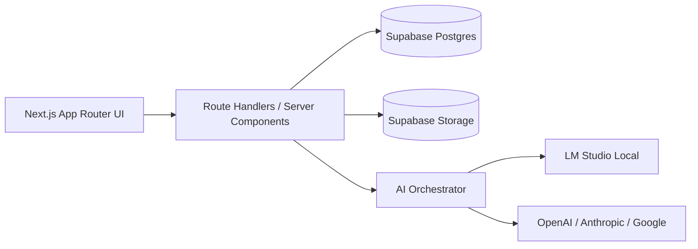

# BookForge Architecture

Last updated: 2026-06-01

## 1. Product Purpose

BookForge is a local-first manuscript platform that takes an author from idea to finished publication package.

Primary domain today:

- Projects
- Books
- Chapters/scenes/paragraphs
- Critic and rewrite workflows
- Exports and finished-book publishing

Emerging direction:

- Admin-first operational controls
- Course-aware domain (planned) layered on top of core book outputs

## 2. System Overview

Core principles:

- Original manuscript text is immutable.
- AI outputs are append-only via revision history.
- Author/admin remains in control of acceptance and export.
- Local AI is default, cloud AI is opt-in.

## 3. Runtime Layers

### 3.1 Frontend

- Next.js App Router pages and server components.
- Mantine component system.
- Client actions call internal API routes.

### 3.2 Backend in App

- Route handlers in `src/app/api/**`.
- Domain logic in `src/lib/**`.
- Supabase server client for authenticated data access.

### 3.3 Data

- Supabase Postgres for book domain entities.
- Supabase Storage for generated exports and binary artifacts.
- RLS policies enforce owner/collaborator boundaries.

### 3.4 AI Execution

- LM Studio orchestration and task-fit model selection.
- Cloud provider routing by execution mode (`auto`, `local`, `cloud`).
- Critic/rewrite/planning operations persist reports and job traces.

## 4. Domain Model (Current)

Primary entities:

- `projects`, `books`
- `chapters`, `scenes`, `paragraphs`
- `book_bibles`, `coherence_reports`
- `revision_jobs`, `revision_versions`, `rewrite_workflows`
- `exports`, `book_matter_sections`
- `series`, `series_notes` (series-level continuity)

Publishing extension:

- `publishing_lab_bundle` reports in `coherence_reports` for post-finish ultimate critic + assets + cover variants.

## 5. Primary Workflows

### 5.1 Existing Manuscript
1. Import/paste manuscript.
2. Structure audit/repair.
3. Summaries + Manuscript Blueprint.
4. Critic lenses.
5. Rewrite planning and execution.
6. Revision accept/reject.
7. Drift + post-rewrite critic.
8. Export and mark finished.
9. Optional Publishing Lab for post-finish packaging and assets.

### 5.2 Create From Idea
1. Concept pass.
2. Architecture pass.
3. Planned chapter draft generation.
4. Auto-Review wizard.
5. Export + finished state.
6. Optional Publishing Lab.

## 6. Data Freshness and Refresh Policy

Problem addressed:

- Always-live fetching can increase API fragility and create avoidable user-facing errors.

Policy:

- Fresh threshold: `< 24h`
- Stale threshold: `>= 24h and < 48h` (show prompt to refresh)
- Expired threshold: `>= 48h` (attempt forced refresh once per stale window)

UX contract:

- Always show freshness status (`Data fetched X ago`).
- Manual refresh is always available.
- If refresh fails, keep stale snapshot visible and show warning + retry.

Implementation components:

- Shared freshness policy helper in `src/lib/freshness/policy.ts`.
- Reusable banner in `src/components/layout/data-freshness-banner.tsx`.
- Route-level integration on dashboard and key workflow pages.

## 7. Reliability and Tooling

Operational events instrumented:

- `freshness_refresh_attempt`
- `freshness_refresh_success`
- `freshness_refresh_failed`
- `freshness_forced_refresh_triggered`

Telemetry sink:

- `POST /api/telemetry/freshness` (server-side operational logging).

Quality gates:

- Unit tests for freshness threshold math (`src/lib/freshness/policy.test.ts`).
- UI tests for stale/expired rendering and fallback behavior (`src/components/layout/data-freshness-banner.test.tsx`).
- PR checklist item: avoid unnecessary route-wide `force-dynamic` usage.

## 8. Security and Access

- Supabase Auth for identity.
- RLS policies for owner and collaborator permissions.
- Sensitive operations scoped to book ownership.
- Cloud provider usage is explicit and configurable by user settings.

## 9. Planned Domain Expansion (Admin + Courses)

Future entities:

- `courses`, `course_modules`, `course_lessons`, `course_assets`, `course_enrollments`.

Integration approach:

- Keep book production as upstream content pipeline.
- Publish accepted book artifacts into course assets via explicit admin actions.
- Apply same freshness policy and refresh UX to admin dashboards.

## 10. Technical Debt Watchlist

- Reduce broad dynamic rendering where not required.
- Move long-running request-bound jobs toward durable background processing.
- Expand automated tests across parsing, rewrite planning, and export assembly.
